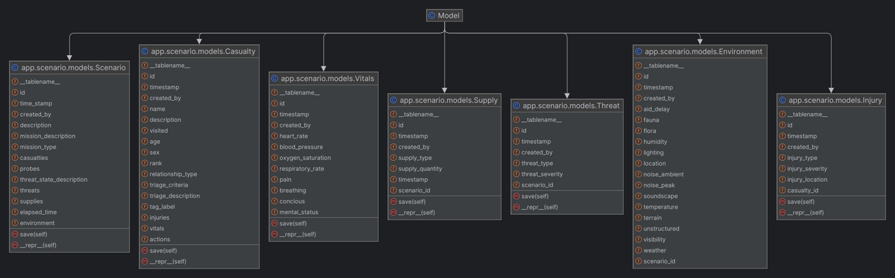
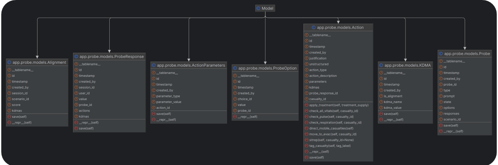
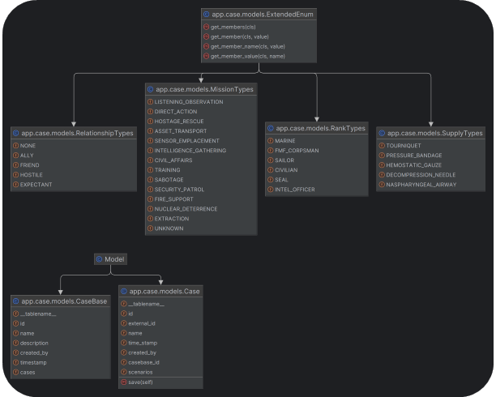

To run, please install requirements and

`flask run --debug` (from the casedb directory)

Goal: Create a reference database from TA1 data that contains coherent cases as assembled from TA1 input files (SoarTech and BBN)

Create an ORM scheme that allows database entities to be treated as objects to interact with both TAD and TA3 API

Provide a basis for Case Based Reasoning of the experimental data
Per conversation with Knexus, allow querying of the Case Base to return objects in TA1 and TA3 form that can be sent to both Decision 
Analytics and TA3 evaluation API on demand

TODO: create functions to return data to the weight learning in the same format as the Excel files to take advantage of the permanence of the database structure but still allow training instances to be conducted as needed.

Refine data ingestion functions and interface. (TA1 and TA3 may be developing separate implementations).

